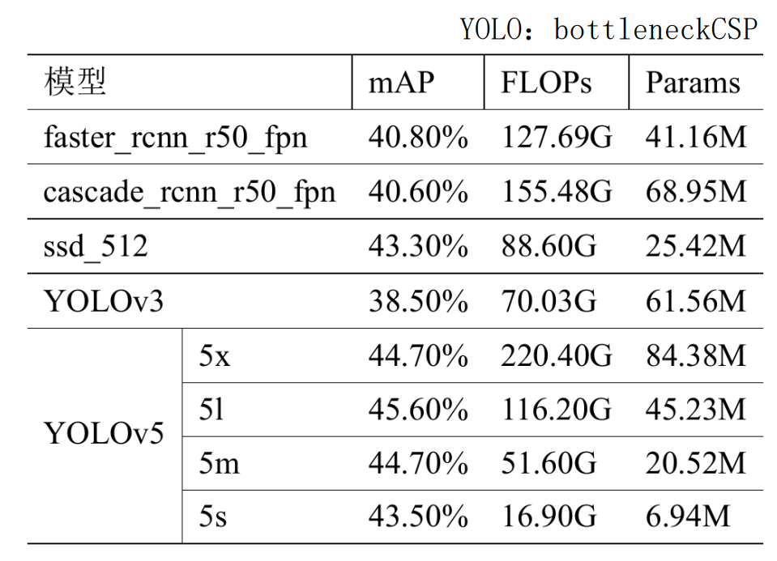
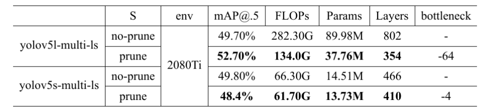
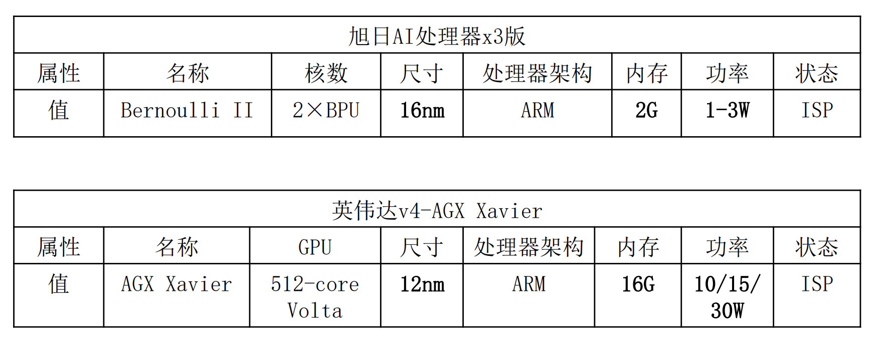
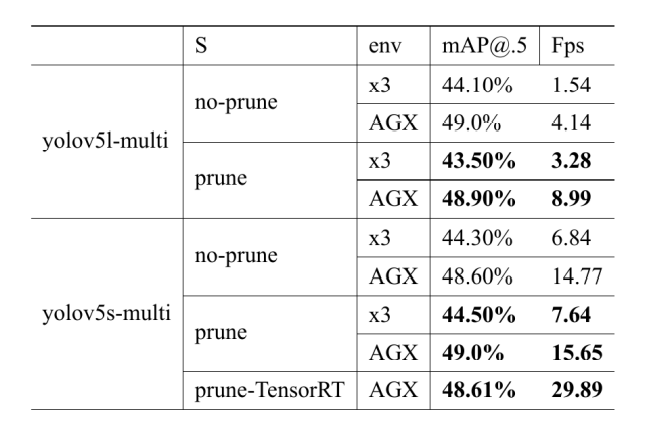
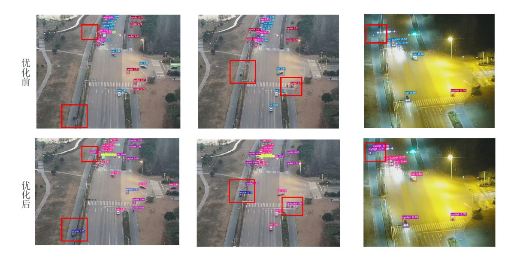
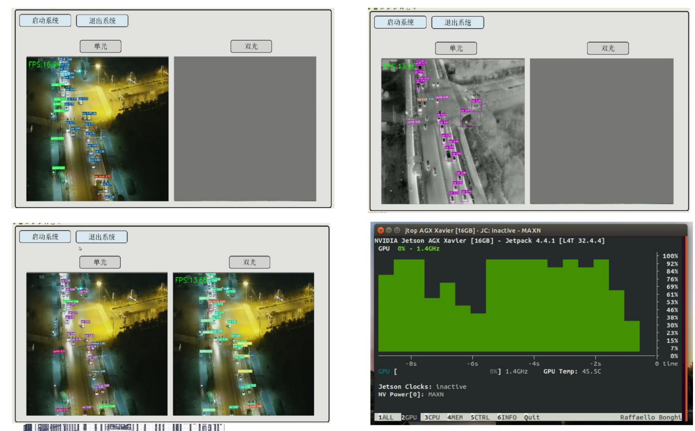

# yolov5-prune-multi
无人机视角、多模态、模型剪枝、国产AI芯片部署  
将训练好的视觉模型，进行剪枝压缩再训练，最终部署到终端设备上。

## 相关实验数据

#### 数据集基础实验(多模态数据集为团队收集，暂未公开)

#### 多模态模型剪枝效果实验

#### 国产芯片与英伟达芯片对比实验

###### 硬件参数

###### 对比实验(硬件性能开到最大)

#### 模型算法效果截图

#### 模型部署到边缘设备效果截图

